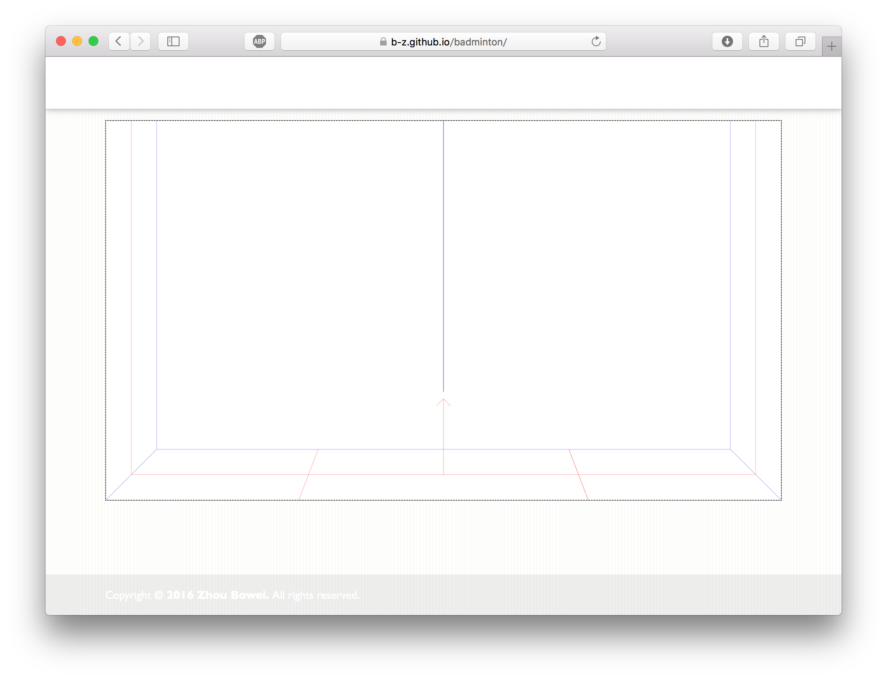

# A badminton game

## Todo list

* [x] 视角支持3D查看 orz

## 开发日志

###6月18日

* 实现透视效果

  

* 羽毛球的运动模型

  $$\vec {x_t} = \vec{c_1}+\vec{c_2}e^{-\gamma t}+\frac{\vec{g}}{\gamma}t$$

  $$\vec{v_t} = -\gamma \vec{c_2}e^{-\gamma t}+\frac{\vec{g}}{\gamma}$$

  $$\vec{c_1}+\vec{c_2} = \vec{x_0}$$

  $$\frac{\vec{g}}{\gamma}-\gamma \vec{c_2} = \vec{v_0}$$

* ​

### 6月17日

* 添加readme
* 添加Player类、Ball类、Point类、Info类、Vector类
* 实现ball的debug绘制

### 6月16日

* 建立基本的框架

* 图片加载(Loader类)与绘制(Paintbrush类)功能

* 绘制调试信息

  